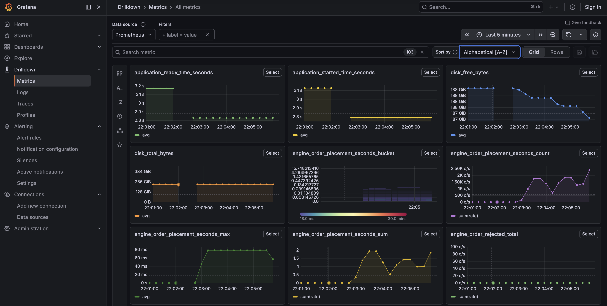

# Fighter Market

[](https://github.com/fewdw/trading/actions/workflows/ci.yml)

A real-time fantasy stock market for UFC fighters: a custom limit-order matching
engine (market/limit orders, price-time priority, an aggregated order book) with
live price and balance updates over WebSockets. You can check out the live deploy [here](https://client-production-2c9e.up.railway.app)

**Stack:** Spring Boot (Java) · Postgres · Next.js (React) · Python scraper · Docker.

## Run

```bash
docker compose up --build
```

Reset the database:

```bash
docker compose down -v && docker compose build --no-cache && docker compose up
```

## Tests

The server suite includes property/invariant tests of the matching engine
(conservation of shares and coins, price-time priority, self-trade prevention)
and a concurrency test of the optimistic-locking path, all run against a real
Postgres via Testcontainers (needs Docker running):

```bash
cd server && ./mvnw test
```

CI (GitHub Actions) builds the server + client, runs this suite, and lints the
client on every push.

## Observability

The backend ships Spring Boot Actuator + Micrometer, exposing Prometheus metrics
at `/actuator/prometheus` and health probes at `/actuator/health`. Custom
matching-engine metrics:

| Metric | Type | What |
|--------|------|------|
| `engine.order.placement` | timer (histogram) | order placement latency + throughput; P99 via histogram buckets |
| `engine.trades` | counter | fills (matched trades) |
| `engine.order.rejected` | counter | rejected placements |
| `websocket.connections.active` | gauge | open WebSocket connections |

A turnkey Prometheus + Grafana stack is in [`monitoring/`](monitoring) (with the
PromQL for each panel). Set `LOG_STRUCTURED_FORMAT=ecs` to emit JSON structured
logs to stdout in production.



## Load testing

[`loadtest/`](loadtest) drives concurrent order placement with k6 and reports
throughput and latency percentiles:

```
throughput:  ~3930 orders/sec
latency p99: ~50.8 ms
```

<!-- Run loadtest/ on your machine and paste your numbers above. -->
See [`loadtest/README.md`](loadtest/README.md) for the one-command run.
